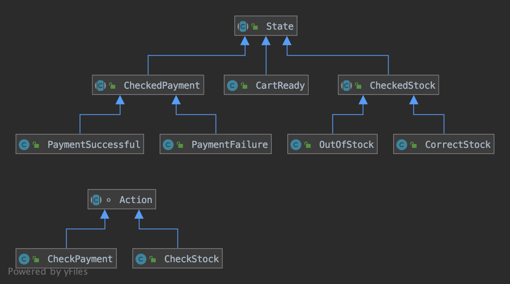

# Purpose
Evaluate Functional Programming using Kotlin vs Java Oriented Object Programming

# Kata description
Create a Shopping Cart with following flow 

# Considerations
* A Service without UI means no main method, no need for Integration testing
* Implementation based on [State Machine](https://en.wikipedia.org/wiki/Finite-state_machine) approach
* Logging used as simplest implementation of [Observability pattern](https://martinfowler.com/articles/domain-oriented-observability.html)
* Enforced Immutability

# Assumptions
* User details, Articles and Cart (Basket) can not be modified
* No user historical data is required
* No progress indicator is required
* No voucher/redemption code is required
* Same user (if name is unique) can be in several states at a given time
* One user only can have one cart associated
* No further requirements are required

# Kotlin Implementation Details
* External system are injected as function parameters

# Java Implementation Details
* SOLID principles
* Criteria for using [Abstract class vs Interface](https://docs.oracle.com/javase/tutorial/java/IandI/abstract.html)
* Not as concise as Kotlin implementation
* State machine is divided in `States` and `Actions` applied to `States`
* To check error type from one `State` to another, `States` and `Actions` hierarchy has been used

    * _Pros_:   
        1. Faster coding feedback, since checking error type is done in IDE
        2. Easier to scale the creation new `States` and `Actions` than if/else statements
    * _Cons_: 
        1. Increase number of _Classes_
        2. Mental state model can be overwhelming, recommendation is to create a visual [Flowchart](https://en.wikipedia.org/wiki/Flowchart) as mentioned 
    
* All objects are immutable
* Immutable objects solves aliasing problem and thread-safe

# Extensions

* If a external system could trigger an `Action`, an API can be implemented with _State_ and _Action_ as parameters
* If Logging (Observability) is required in each step it can be done using [annotations](https://kotlinlang.org/docs/reference/annotations.html)
* If User or Articles attributes can be modified `Cart Ready` _state_ could have another branch that returns to it
* If articles added in Cart (Basket) added of subtracted `Cart Ready` state could have another branch that returns to it, except if Basket is empty
* If recommendations is required, AB Testing can be done to validate assumptions of articles shown
* If voucher or redeem code is required, _total price_ could be calculated in `Stock Checked` state, therefore `Stock Checked` could have another branch from that returns to it
* If progress indicator is required, similar approach as _logging_ can be used
* If historical data is required to be stored, add integration with a _data base_ in the same as logging
* If a timer is required, using Observability to log time for each State change and implement an API to interact
* If restrictions:
    * Only one user can be in the same _State_ at the same time.
        1. Using same approach as logging, save a _snapshot_ of the system relating _User_ to _State_
        2. Validation of the _snapshot_ can be done before or after any `Action` with _Annotation_ or _AOP_
    * The item added in Cart needs to be unique
        * Use unique identifiers for Articles in Basket
* If external system take longer to give a response than considered acceptable, approaches:
    * Inform the user a problem has occurred and user will try again
    * Implement an asynchronous system based on:
        1. Coroutines
        2. Reactive streams [Coroutines can work with reactive Streams](https://github.com/Kotlin/kotlinx.coroutines/blob/master/reactive/coroutines-guide-reactive.md)
        3. Events

